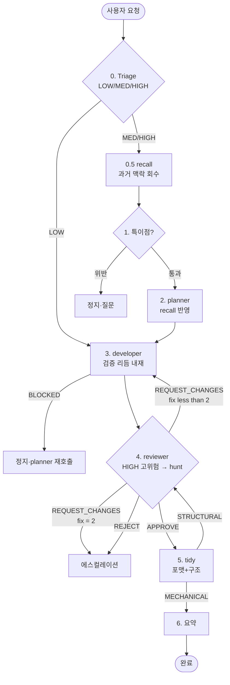
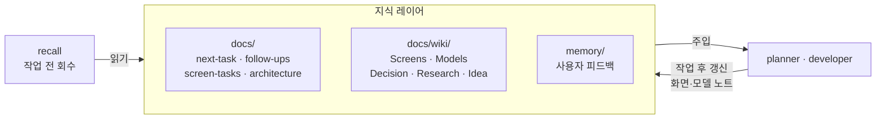

# 에이전트 오케스트레이션 개요

HomePin iOS 개발 워크플로의 전체 그림이다. 각 역할의 세부 절차는 `docs/agents/`
하위 개별 문서를, 규약 원문은 `CLAUDE.md` 를 단일 기준으로 한다. 이 문서는 그것들을
하나의 흐름으로 잇는 지도다.

## 한눈에

에이전트 시스템은 3개 레이어로 돌아간다.

1. **오케스트레이션** (`hpi:auto`) — 메인 루프가 작업을 분류하고 역할을 순서대로 지휘.
2. **역할 에이전트** — 각자 한 가지 책임만 (회수/기획/구현/리뷰/정리).
3. **지식 레이어** — 코드 문서·위키·메모리. 회수(recall)로 **읽고**, 작업 후 **갱신**.

핵심 원칙 두 가지: **관심사 분리**(각 역할이 한 가지만) + **Maker-Checker**(만드는
자와 검사하는 자를 분리).

## 에이전트 구성

| 에이전트 | 책임 | 쓰기 권한 | 호출 | 문서 |
| --- | --- | --- | --- | --- |
| recall | 작업 전 관련 과거 맥락(결정·폐기한 접근·미결) 회수 | 읽기 전용 | `hpi:recall` | [[recall]] |
| planner | 요청 → 화면/`@Observable` 범위·수락기준·영향범위 | 문서만 | `hpi:plan` | [[planner]] |
| developer | 구현 + 검증 리듬 내재(수정 2회마다 검증) | 코드+문서 | `hpi:dev` | [[developer]] |
| reviewer | 단일 패스 리뷰 + AI 실패 5패턴 가드 | 읽기 전용 | `hpi:review` | [[reviewer]] |
| hunt | 5렌즈 병렬 리뷰 + 반증 검증 (깊은 리뷰) | 읽기 전용 | `hpi:hunt` | [[hunt]] |
| tidy | 포맷·구조 일관성 정리 | 코드(스타일만) | `hpi:tidy` | [[tidy]] |

## hpi:auto 메인 플로우



읽는 법:

- **진입점이 등급별로 다르다** — LOW 는 recall·planner 를 건너뛰고(빠르게),
  HIGH 는 풀 코스를 탄다. (Triage 루브릭은 `CLAUDE.md` "자동 진행 명령" 참고)
- **수렴 루프** = `developer ⇄ reviewer` 를 최대 2회(= 리뷰 최대 3회). 무한
  핸드오프를 막는다.
- **정지 4종** — 특이점 위반 / developer `BLOCKED` / `REJECT` / fix 2회 소진. 전부
  사용자에게 넘긴다(자동으로 밀어붙이지 않는다).
- **hunt 는 reviewer 의 선택적 심화** — HIGH·고위험 변경에서 단일 reviewer 대신
  (또는 APPROVE 후 한 번 더) 다중 렌즈 병렬 리뷰를 돌린다. 비용이 크므로 한정한다.

## 지식 레이어 (recall ↔ 에이전트)



선순환: developer 가 결정·진도·화면/모델 노트를 문서에 쌓고 → recall 이 다음 작업
시작 때 꺼내 주입 → 같은 실수·폐기한 접근 반복을 막는다 ("탐색 품질이 결과 품질을
결정").

지식 → 코드 문서 동기화 규칙은 `CLAUDE.md` "문서 동기화" 표를 따른다.

## 단독 호출

`hpi:auto` 만 체인 전체를 돈다. 나머지는 한 역할만 콕 집어 실행한다.

```txt
hpi:plan    기획/범위        hpi:tidy    스타일·구조 정리
hpi:dev     구현             hpi:recall  과거 맥락 회수
hpi:review  단일 리뷰        hpi:hunt    다중 렌즈 깊은 리뷰
hpi:auto    전체 자동 진행
```

`hpi:recall` 은 체인 밖 보조 워크플로다.

## Claude / Codex 공유

`docs/agents/*.md`(절차)와 `CLAUDE.md`(규약)는 Claude Code 와 Codex 가 공유하는 단일
소스다. **`CLAUDE.md` 가 진짜 소스 오브 트루스**이고, Codex 진입점 `AGENTS.md` 는
`@CLAUDE.md` 로 그 내용을 가져온 뒤 Codex 전용 보충만 덧붙인다. 트리거만 분리된다 —
Claude 는 `.claude/commands/`·`.claude/agents/`, Codex 는 `.codex/agents/*.toml`. 단
`hpi:hunt` 는 `Workflow` 툴 기반이라 **Claude Code 전용**이다 (스크립트:
`.claude/workflows/hunt-review.js`).
