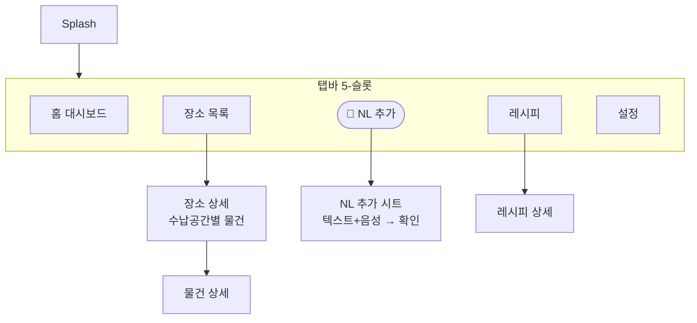

# 화면 맵

상세 결정: `docs/wiki/Decision/2026-06-12-네비게이션-UI구조.md`.

## 흐름

## 화면 목록

| 화면 | 역할 | 상태 |
| --- | --- | --- |
| Splash | 진입 분기 | done |
| Home | 대시보드(검색·임박·바로가기) | 예정 |
| Places (장소 목록) | Area 그리드(개수·미리보기) | 개발 중 |
| PlaceDetail (장소 상세) | Spot별 Item 목록 | 개발 중 |
| Recipes (레시피) | 임박 카드 + 추천 목록 | 개발 중 |
| Capture (NL 추가) | 텍스트+음성 → 구조화 확인 | 예정 |
| Settings | 설정 | stub |
| ItemDetail / RecipeDetail | 상세 | 예정 |

UI 우선 — seed 데이터로 화면을 먼저 만들고 AI/로직은 뒤에 채운다.
