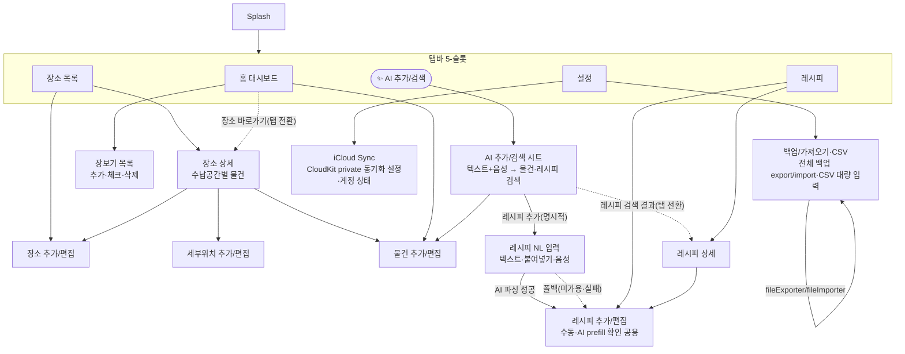

# 화면 맵

상세 결정: `docs/wiki/Decision/2026-06-12-네비게이션-UI구조.md`.

## 흐름

```mermaid
flowchart TD
    Splash --> Tab
    subgraph Tab[탭바 5-슬롯]
      Home[홈 대시보드]
      Places[장소 목록]
      AI([✨ AI 추가/검색])
      Recipes[레시피]
      Settings[설정]
    end
    Places --> PlaceDetail[장소 상세<br/>수납공간별 물건]
    Places --> PlaceEditor[장소 추가/편집]
    PlaceDetail --> PlaceEditor
    PlaceDetail --> SpotEditor[세부위치 추가/편집]
    PlaceDetail --> ItemEditor[물건 추가/편집]
    Home --> ItemEditor
    Home --> Shopping[장보기 목록<br/>추가·체크·삭제]
    Home -. 장소 바로가기(탭 전환) .-> PlaceDetail
    Capture --> ItemEditor
    AI --> Capture[AI 추가/검색 시트<br/>텍스트+음성 → 물건·레시피 검색]
    Capture -. 레시피 검색 결과(탭 전환) .-> RecipeDetail
    Capture -- 레시피 추가(명시적) --> RecipeCapture[레시피 NL 입력<br/>텍스트·붙여넣기·음성]
    RecipeCapture -- AI 파싱 성공 --> RecipeEditor
    RecipeCapture -. 폴백(미가용·실패) .-> RecipeEditor
    Recipes --> RecipeDetail[레시피 상세]
    Recipes --> RecipeEditor[레시피 추가/편집<br/>수동·AI prefill 확인 공용]
    RecipeDetail --> RecipeEditor
    Settings --> CloudSync[iCloud Sync<br/>CloudKit private 동기화 설정·계정 상태]
    Settings --> DataTransfer[백업/가져오기·CSV<br/>전체 백업 export/import·CSV 대량 입력]
    DataTransfer -- fileExporter/fileImporter --> DataTransfer
```

## 화면 목록

| 화면 | 역할 | 상태 |
| --- | --- | --- |
| Splash | 진입 분기 | done |
| Home | 대시보드(검색·임박·바로가기) | in-progress |
| Places (장소 목록) | Area 그리드(개수·미리보기)·장소 추가/편집/삭제 진입 | in-progress |
| PlaceDetail (장소 상세) | Spot별 Item 목록·물건 추가/편집 진입·장소 편집/삭제 | in-progress |
| PlaceEditor (장소 추가/편집) | Area 추가/편집 공용 시트(이름) | in-progress |
| SpotEditor (세부위치 추가/편집) | Spot 추가/편집 공용 시트(이름) | in-progress |
| Recipes (레시피) | 임박 카드 + 추천 목록·상세 진입·레시피 추가 | in-progress |
| Capture (AI 추가/검색) | 텍스트+음성 → 물건·레시피 검색 + 물건/레시피 추가 진입 | in-progress |
| RecipeCapture (레시피 NL 입력) | 여러 줄 텍스트·붙여넣기·음성 → AI 파싱 → 확인 에디터 prefill | in-progress |
| Shopping (장보기) | 살 것 목록 — 수동 추가·체크·삭제 | in-progress |
| DraftReview (확인 드래프트) | 물건 AI 파서 결과 확인 화면. 현재 중앙 추가 경로에서는 미연결 | paused |
| Settings (설정) | 표시(테마)·데이터(현황·iCloud Sync·백업/가져오기·전체 정리)·정보 | in-progress |
| DataTransfer (백업/가져오기·CSV) | 전체 백업 export/import(디렉터리 패키지·id upsert) + CSV 대량 입력(Item·Recipe, 템플릿) | in-progress |
| ItemEditor | 물건 추가/편집 공용 시트 | in-progress |
| RecipeDetail (레시피 상세) | 재료(보유 상태)·조리 단계·재고 요약·편집/삭제 진입 | in-progress |
| RecipeEditor (레시피 추가/편집) | 기본정보 + 재료/단계 동적 편집 공용 시트(수동·AI prefill 확인 공용) | in-progress |

UI 우선 — seed 데이터로 화면을 먼저 만들고 AI/로직은 뒤에 채운다.
